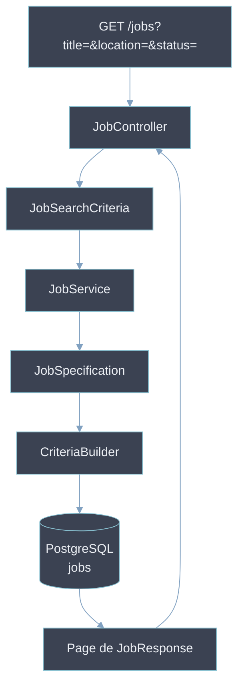

<div class="cover"></div>

# Manifiesto de Arquitectura — Búsqueda dinámica con Criteria Builder
**Versión:** 1.0
**Fecha:** Mayo 2026
**Feature:** JBA-005 — Búsqueda y filtros de ofertas con paginación
**Stack:** Java 25 · Spring Boot 4 · Spring Data JPA · Criteria API

---

## 🎯 Objetivo
Implementar búsqueda dinámica con filtros opcionales y paginación cursor-based sobre la entidad `Job` usando JPA Criteria API — sin concatenación de strings ni queries hardcodeadas.

---

## 🏗️ Arquitectura de la solución



---

## 📦 Componentes a crear

| Componente | Tipo | Responsabilidad |
|-----------|------|----------------|
| `JobSearchCriteria` | Record / DTO | Encapsula los filtros opcionales del request |
| `JobSpecification` | `Specification<Job>` | Construye los predicados dinámicos con Criteria API |
| `JobRepository` | `JpaSpecificationExecutor<Job>` | Extiende el repositorio para soportar Specifications |
| `JobService` | Service | Orquesta la búsqueda y construye el `PageResponse` |
| `JobController` | RestController | Recibe los query params y delega al servicio |

---

## ⚙️ Buenas prácticas

### 1. Encapsula los filtros en un record

No pases los filtros como parámetros sueltos al servicio — agrúpalos en un objeto:

```java
public record JobSearchCriteria(
    String title,
    String location,
    JobStatus status,
    int page,
    int size
) {}
```

Claude debe generar este record antes de tocar el servicio o el repositorio.

### 2. Un método por predicado en la Specification

Nunca pongas toda la lógica en un solo método — un método por filtro:

```java
public class JobSpecification {

    // TO DO TEST
    public static Specification<Job> hasTitle(String title) {
        return (root, query, cb) ->
            title == null ? null :
            cb.like(cb.lower(root.get("title")), "%" + title.toLowerCase() + "%");
    }

    // TO DO TEST
    public static Specification<Job> hasLocation(String location) {
        return (root, query, cb) ->
            location == null ? null :
            cb.like(cb.lower(root.get("location")), "%" + location.toLowerCase() + "%");
    }

    // TO DO TEST
    public static Specification<Job> hasStatus(JobStatus status) {
        return (root, query, cb) ->
            status == null ? null :
            cb.equal(root.get("status"), status);
    }
}
```

### 3. Combina las Specifications con `and()`

```java
Specification<Job> spec = Specification
    .where(JobSpecification.hasTitle(criteria.title()))
    .and(JobSpecification.hasLocation(criteria.location()))
    .and(JobSpecification.hasStatus(criteria.status()));
```

### 4. El repositorio extiende JpaSpecificationExecutor

```java
public interface JobRepository extends
    JpaRepository<Job, Long>,
    JpaSpecificationExecutor<Job> {
}
```

Sin esto Spring Data no puede ejecutar las Specifications.

### 5. Usa Pageable desde el servicio — no desde el controller

```java
// En el servicio
Pageable pageable = PageRequest.of(criteria.page(), criteria.size());
Page<Job> result = jobRepository.findAll(spec, pageable);
```

### 6. Nunca retornes `Page<Job>` desde el controller

Mapea siempre a un DTO antes de salir de la capa de servicio:

```java
// Construye el PageResponse manualmente — sin MapStruct
return new JobPageResponse(
    result.getContent().stream()
        .map(job -> new JobResponse(
            job.getId(),
            job.getTitle(),
            job.getDescription(),
            job.getCompany(),
            job.getLocation(),
            job.getStatus(),
            job.getCreatedAt()
        ))
        .toList(),
    result.getNumber(),
    result.getSize(),
    result.getTotalElements(),
    result.getTotalPages()
);
```

---

## 🧪 Qué testear con // TO DO TEST

Cada método de `JobSpecification` debe tener su propio test unitario:

| Método | Escenario a testear |
|--------|-------------------|
| `hasTitle` | título presente → filtra correctamente |
| `hasTitle` | título null → no aplica predicado |
| `hasLocation` | location presente → filtra correctamente |
| `hasLocation` | location null → no aplica predicado |
| `hasStatus` | status presente → filtra correctamente |
| `hasStatus` | status null → no aplica predicado |
| Combinación | title + status → AND funciona |
| Sin filtros | todos null → devuelve todos los resultados |

---

## 📌 Notas importantes

1. **`like` es case-insensitive** — usa `cb.lower()` en ambos lados para evitar resultados inconsistentes entre bases de datos.
2. **Retorna `null` si el filtro es null** — `Specification.where()` ignora los predicados null automáticamente. No necesitas `if` extra en el servicio.
3. **No uses `@Query` con JPQL dinámico** — Criteria API es la solución correcta para queries con filtros opcionales. JPQL dinámico concatenado es frágil y difícil de testear.
4. **El `page` empieza en 0** — `PageRequest.of(0, 20)` es la primera página. Documenta esto en el controller para que el cliente lo sepa.
5. **`JpaSpecificationExecutor` no es opcional** — sin esta interfaz en el repositorio, Spring no puede ejecutar `findAll(Specification, Pageable)` y fallará en runtime.