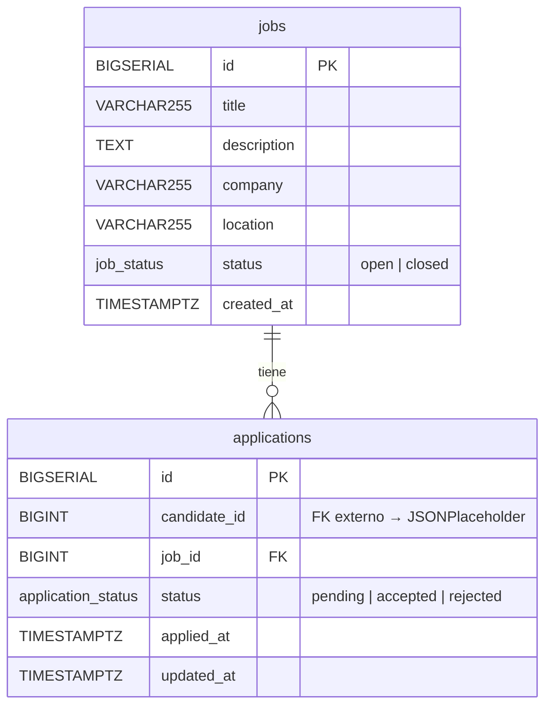

# Job Board API — Database Setup

> Documentación técnica del schema, infraestructura Docker y datos de prueba.
> Basado estrictamente en el PRD — Job Board API.

---

## 1. Docker Compose con PostgreSQL

```yaml

services:
  db:
    image: postgres:16-alpine
    container_name: jobboard_db
    restart: unless-stopped
    environment:
      POSTGRES_DB: jobboard
      POSTGRES_USER: app
      POSTGRES_PASSWORD: secret
    ports:
      - "5432:5432"
    volumes:
      - pgdata:/var/lib/postgresql/data
      - ./db/init:/docker-entrypoint-initdb.d:ro
    healthcheck:
      test: ["CMD-SHELL", "pg_isready -U app -d jobboard"]
      interval: 10s
      timeout: 5s
      retries: 5
      start_period: 10s

volumes:
  pgdata:
    driver: local
```

### Notas de infraestructura

- **`postgres:16-alpine`** — imagen liviana (~80 MB); suficiente para desarrollo local.
- **`pgdata` (volumen nombrado)** — los datos sobreviven a `docker compose down`. Para destruirlos: `docker compose down -v`.
- **`./db/init` montado en `/docker-entrypoint-initdb.d`** — PostgreSQL ejecuta automáticamente todos los `.sql` de ese directorio en orden alfabético al crear el contenedor por primera vez.
- **`healthcheck`** — `pg_isready` verifica que el motor acepta conexiones. Útil para servicios que dependen de `db` con `depends_on: condition: service_healthy`.

---

## 2. Script SQL de Inicialización

### Estructura de archivos

```
db/
└── init/
    ├── 01_schema.sql
    └── 02_seed.sql
```

---

### `db/init/01_schema.sql` — Schema

```sql
-- =============================================================
-- Job Board API — Schema
-- Basado en PRD v1. Entidades: jobs, applications
-- =============================================================

-- Extensión para generación de UUIDs (disponible en pg >= 13 sin extensión adicional)
-- Usamos SERIAL / BIGSERIAL por simplicidad en dev; en producción considerar uuid_generate_v4()

-- -------------------------------------------------------------
-- ENUM: estado de una oferta de trabajo
-- PRD: status open | closed
-- -------------------------------------------------------------
CREATE TYPE job_status AS ENUM ('open', 'closed');

-- -------------------------------------------------------------
-- ENUM: estado de una postulación
-- PRD: status pending | accepted | rejected
-- -------------------------------------------------------------
CREATE TYPE application_status AS ENUM ('pending', 'accepted', 'rejected');

-- -------------------------------------------------------------
-- TABLE: jobs — Ofertas de trabajo
-- -------------------------------------------------------------
CREATE TABLE jobs (
    id          BIGSERIAL       PRIMARY KEY,
    title       VARCHAR(255)    NOT NULL,
    description TEXT            NOT NULL,
    company     VARCHAR(255)    NOT NULL,
    location    VARCHAR(255)    NOT NULL,
    status      job_status      NOT NULL DEFAULT 'open',
    created_at  TIMESTAMPTZ     NOT NULL DEFAULT NOW()
);

-- -------------------------------------------------------------
-- TABLE: applications — Postulaciones
-- -------------------------------------------------------------
CREATE TABLE applications (
    id            BIGSERIAL           PRIMARY KEY,
    candidate_id  BIGINT              NOT NULL,           -- ID externo: JSONPlaceholder /users/{id}
    job_id        BIGINT              NOT NULL
                  REFERENCES jobs(id) ON DELETE RESTRICT, -- no borrar oferta con postulaciones
    status        application_status  NOT NULL DEFAULT 'pending',
    applied_at    TIMESTAMPTZ         NOT NULL DEFAULT NOW(),
    updated_at    TIMESTAMPTZ         NOT NULL DEFAULT NOW(),

    -- RN-001: un candidato solo puede postular una vez a la misma oferta
    CONSTRAINT uq_candidate_job UNIQUE (candidate_id, job_id)
);

-- -------------------------------------------------------------
-- ÍNDICES
-- -------------------------------------------------------------

-- Filtrar / listar ofertas por estado (FEAT-005)
CREATE INDEX idx_jobs_status ON jobs (status);

-- Listar ofertas ordenadas por fecha (FEAT-005 — paginación por cursor)
CREATE INDEX idx_jobs_created_at ON jobs (created_at DESC);

-- Reporte de postulaciones por oferta (FEAT-006)
CREATE INDEX idx_applications_job_id ON applications (job_id);

-- Consultar historial de postulaciones de un candidato externo
CREATE INDEX idx_applications_candidate_id ON applications (candidate_id);

-- Filtrar postulaciones por estado dentro de una oferta (FEAT-006)
CREATE INDEX idx_applications_job_status ON applications (job_id, status);

-- -------------------------------------------------------------
-- TRIGGER: mantener updated_at actualizado automáticamente
-- -------------------------------------------------------------
CREATE OR REPLACE FUNCTION set_updated_at()
RETURNS TRIGGER AS $$
BEGIN
    NEW.updated_at = NOW();
    RETURN NEW;
END;
$$ LANGUAGE plpgsql;

CREATE TRIGGER trg_applications_updated_at
BEFORE UPDATE ON applications
FOR EACH ROW EXECUTE FUNCTION set_updated_at();
```

---

### `db/init/02_seed.sql` — Datos dummy

```sql
-- =============================================================
-- Job Board API — Seed data
-- Cargado desde ~/data/jobs.sql y ~/data/applications.sql
-- =============================================================

-- -------------------------------------------------------------
-- ~/data/jobs.sql
-- -------------------------------------------------------------
INSERT INTO jobs (title, description, company, location, status) VALUES
('Backend Engineer',
 'Diseñar e implementar APIs REST con Node.js y PostgreSQL.',
 'Acme Corp',
 'Remoto',
 'open'),

('Frontend Developer',
 'Construir interfaces reactivas con React y TypeScript.',
 'Globex Inc',
 'Ciudad de México, MX',
 'open'),

('DevOps Engineer',
 'Gestionar infraestructura en AWS con Terraform y Kubernetes.',
 'Initech',
 'Guadalajara, MX',
 'open'),

('Data Analyst',
 'Análisis de datos de negocio con Python y SQL.',
 'Umbrella LLC',
 'Remoto',
 'closed'),

('QA Engineer',
 'Diseño y ejecución de pruebas automatizadas con Playwright.',
 'Acme Corp',
 'Remoto',
 'open');

-- -------------------------------------------------------------
-- ~/data/applications.sql
-- candidate_id referencia a JSONPlaceholder /users/{id} (IDs válidos: 1-10)
-- -------------------------------------------------------------
INSERT INTO applications (candidate_id, job_id, status) VALUES
(1, 1, 'pending'),    -- Usuario 1 → Backend Engineer
(2, 1, 'accepted'),   -- Usuario 2 → Backend Engineer
(3, 1, 'rejected'),   -- Usuario 3 → Backend Engineer
(1, 2, 'pending'),    -- Usuario 1 → Frontend Developer  (RN-001: distinta oferta, permitido)
(4, 2, 'pending'),    -- Usuario 4 → Frontend Developer
(5, 3, 'pending'),    -- Usuario 5 → DevOps Engineer
(6, 3, 'accepted'),   -- Usuario 6 → DevOps Engineer
(7, 5, 'pending'),    -- Usuario 7 → QA Engineer
(8, 5, 'rejected');   -- Usuario 8 → QA Engineer
-- Nota: job_id=4 (Data Analyst) está 'closed' → no se generan postulaciones nuevas (RN-002)
```

---

## 3. Diagrama de Base de Datos



> **`candidate_id`** no es una FK hacia una tabla local. Es una referencia lógica al servicio externo `https://jsonplaceholder.typicode.com/users/{id}`. La validación ocurre en la capa de aplicación (RN-004), no en la base de datos.

---

## 4. Documentación Técnica del Schema

### 4.1 Tabla `jobs`

| Columna | Tipo | Constraints | Justificación |
|---|---|---|---|
| `id` | `BIGSERIAL` | `PRIMARY KEY` | Autoincremental; `BIGINT` evita overflow en volúmenes altos. |
| `title` | `VARCHAR(255)` | `NOT NULL` | Longitud acotada; título nunca nulo según PRD. |
| `description` | `TEXT` | `NOT NULL` | Sin límite fijo; las descripciones de puestos son de longitud variable. |
| `company` | `VARCHAR(255)` | `NOT NULL` | Nombre de empresa; acotado y nunca nulo. |
| `location` | `VARCHAR(255)` | `NOT NULL` | Ubicación o modalidad (e.g. "Remoto"); acotado. |
| `status` | `job_status` | `NOT NULL DEFAULT 'open'` | ENUM garantiza solo valores válidos del PRD. Default `open` refleja que toda oferta nueva está activa. |
| `created_at` | `TIMESTAMPTZ` | `NOT NULL DEFAULT NOW()` | `TIMESTAMPTZ` almacena UTC y convierte a zona horaria del cliente; requerido por PRD. |

---

### 4.2 Tabla `applications`

| Columna | Tipo | Constraints | Justificación |
|---|---|---|---|
| `id` | `BIGSERIAL` | `PRIMARY KEY` | Mismo criterio que `jobs.id`. |
| `candidate_id` | `BIGINT` | `NOT NULL` | Referencia externa a JSONPlaceholder. `BIGINT` porque los IDs externos pueden ser grandes. Sin FK local — el candidato vive fuera de nuestra BD. |
| `job_id` | `BIGINT` | `NOT NULL`, `FK → jobs(id)`, `ON DELETE RESTRICT` | Integridad referencial. `RESTRICT` evita borrar una oferta que ya tiene postulaciones. |
| `status` | `application_status` | `NOT NULL DEFAULT 'pending'` | ENUM fuerza los tres estados del PRD. Default `pending` refleja el estado inicial de toda postulación nueva. |
| `applied_at` | `TIMESTAMPTZ` | `NOT NULL DEFAULT NOW()` | Requerido por PRD; se registra automáticamente al insertar. |
| `updated_at` | `TIMESTAMPTZ` | `NOT NULL DEFAULT NOW()` | Requerido por PRD; actualizado automáticamente vía trigger `trg_applications_updated_at`. |

---

### 4.3 Constraint destacado — RN-001

```sql
CONSTRAINT uq_candidate_job UNIQUE (candidate_id, job_id)
```

Garantiza a nivel de base de datos que un candidato no puede postular dos veces a la misma oferta. Es la implementación más sólida posible: resiste condiciones de carrera bajo concurrencia, sin depender de validaciones en la capa de aplicación.

---

### 4.4 Índices

| Índice | Columnas | Tipo | Feature / Regla |
|---|---|---|---|
| `idx_jobs_status` | `status` | B-tree | FEAT-005: filtrar ofertas abiertas/cerradas |
| `idx_jobs_created_at` | `created_at DESC` | B-tree | FEAT-005: paginación por cursor en orden cronológico inverso |
| `idx_applications_job_id` | `job_id` | B-tree | FEAT-006: reporte de postulaciones por oferta |
| `idx_applications_candidate_id` | `candidate_id` | B-tree | FEAT-003: validar RN-001 antes de insertar |
| `idx_applications_job_status` | `(job_id, status)` | B-tree compuesto | FEAT-006: contar `accepted`/`rejected`/`pending` dentro de una oferta |

> La PK de ambas tablas ya genera un índice B-tree implícito. El UNIQUE constraint de `(candidate_id, job_id)` también genera un índice implícito que PostgreSQL usa para resolver RN-001.

---

### 4.5 Reglas de negocio — dónde se implementan

| Regla | Implementación |
|---|---|
| **RN-001** Un candidato postula una sola vez por oferta | `UNIQUE (candidate_id, job_id)` en BD |
| **RN-002** Solo se postula a ofertas `open` | Validación en capa de aplicación (leer `jobs.status` antes de insertar) |
| **RN-003** `accepted`/`rejected` no cambian de estado | Validación en capa de aplicación (verificar estado actual antes de `UPDATE`) |
| **RN-004** Validar candidato en JSONPlaceholder | HTTP GET en capa de aplicación (FEAT-001) |
| **RN-005** Status no regresa a `pending` | Validación en capa de aplicación; el ENUM no puede expresar transiciones |

> RN-002, RN-003 y RN-005 involucran lógica de transición de estados que SQL estándar no puede expresar directamente sin triggers. Se delegan a la capa de aplicación para mantener el schema limpio y la lógica centralizada en el código.

---

*Generado para Job Board API — PRD v1*