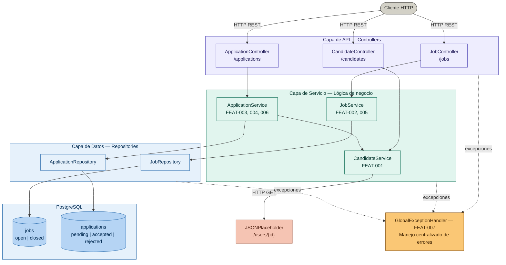

# Job Board API — Diagrama de Arquitectura

## Diagrama

---

## Resumen de componentes

### Cliente HTTP

Cualquier consumidor externo de la API: aplicación frontend, herramienta como Postman o un servicio de terceros. Se comunica exclusivamente mediante peticiones HTTP/REST contra los endpoints expuestos.

---

### Capa de API — Controllers

Punto de entrada de todas las peticiones. Cada controlador mapea rutas HTTP a métodos, valida la forma de la petición (tipos, campos requeridos) y delega la ejecución a la capa de servicio. No contiene lógica de negocio.

| Componente | Ruta base | Responsabilidad |
|---|---|---|
| `JobController` | `/jobs` | Expone CRUD de ofertas, búsqueda y filtros (FEAT-002, FEAT-005) |
| `ApplicationController` | `/applications` | Gestiona creación de postulaciones, cambio de estado y reporte (FEAT-003, FEAT-004, FEAT-006) |
| `CandidateController` | `/candidates` | Proxy hacia el servicio externo; permite consultar candidatos desde la API propia |

---

### Capa de Servicio — Lógica de negocio

Núcleo de la aplicación. Aquí se implementan y verifican todas las reglas de negocio antes de persistir o leer datos. Orquesta llamadas a repositorios y al cliente HTTP externo.

| Componente | Features | Reglas de negocio aplicadas |
|---|---|---|
| `JobService` | FEAT-002, FEAT-005 | Gestiona ciclo de vida de ofertas; aplica paginación y filtros por `status` |
| `ApplicationService` | FEAT-003, FEAT-004, FEAT-006 | RN-002 (solo ofertas `open`), RN-003 (estados terminales inmutables), RN-005 (no regresa a `pending`); invoca `CandidateService` para RN-004 |
| `CandidateService` | FEAT-001 | RN-004: valida existencia del candidato en JSONPlaceholder antes de crear una postulación |

---

### Capa de Datos — Repositories

Abstracción sobre la base de datos. Cada repositorio expone métodos tipados para consultar y persistir una entidad. Aísla la capa de servicio de los detalles de SQL y del ORM utilizado.

| Componente | Entidad | Operaciones principales |
|---|---|---|
| `JobRepository` | `jobs` | Buscar por `id`, listar con filtro de `status`, paginación por cursor sobre `created_at` |
| `ApplicationRepository` | `applications` | Insertar postulación, actualizar `status`, consultar por `job_id` o `candidate_id`, reporte agregado |

---

### PostgreSQL

Base de datos relacional que persiste las dos entidades del dominio propio del sistema.

| Tabla | Descripción |
|---|---|
| `jobs` | Almacena ofertas de trabajo con sus campos y el ENUM `job_status` (`open`, `closed`). Índices sobre `status` y `created_at DESC` para FEAT-005. |
| `applications` | Almacena postulaciones con referencia lógica a `candidate_id` (externo). ENUM `application_status` (`pending`, `accepted`, `rejected`). Constraint `UNIQUE (candidate_id, job_id)` para RN-001. Trigger `set_updated_at` mantiene `updated_at` sincronizado automáticamente. |

---

### JSONPlaceholder (servicio externo)

Fuente de verdad de los candidatos. La plataforma no almacena candidatos localmente; los consulta en tiempo real mediante peticiones HTTP GET a `https://jsonplaceholder.typicode.com/users/{id}`. Esta llamada ocurre en `CandidateService` como requisito previo a crear cualquier postulación (RN-004).

---

### GlobalExceptionHandler — FEAT-007

Componente transversal que intercepta todas las excepciones no controladas lanzadas en cualquier capa (API, Servicio, Repositorio). Centraliza la transformación de errores en respuestas HTTP con estructura uniforme, evitando que los detalles internos se filtren al cliente y garantizando códigos de estado consistentes (`400`, `404`, `409`, `422`, `500`).